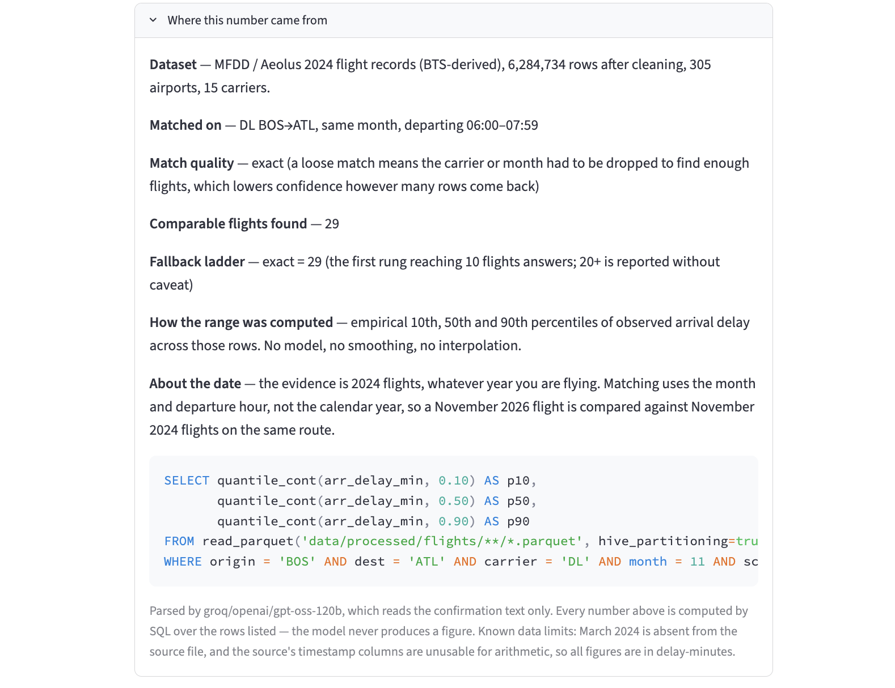
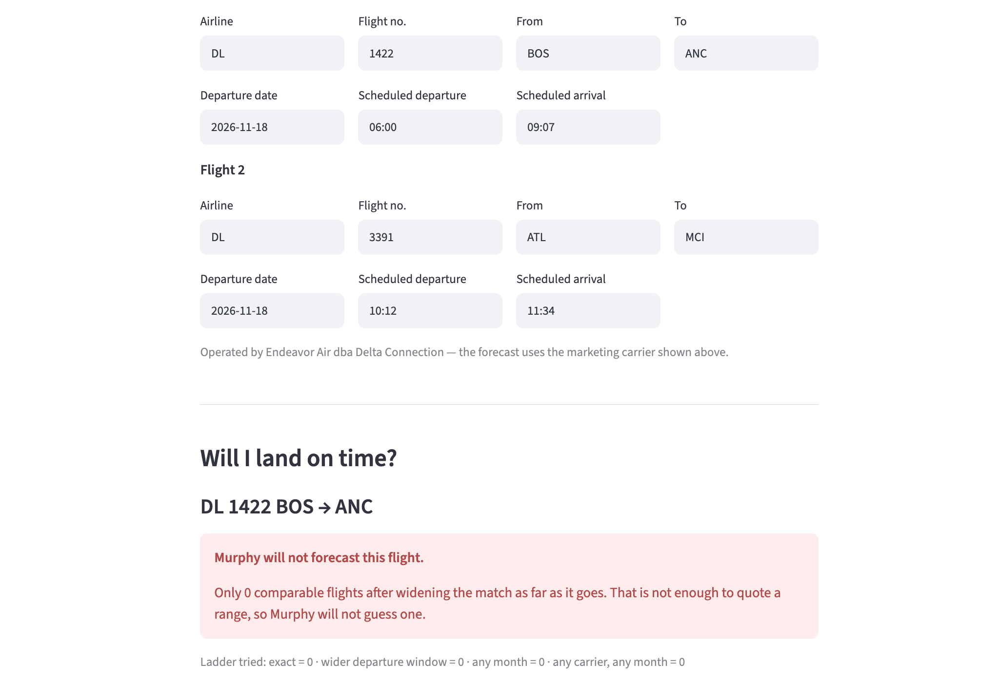
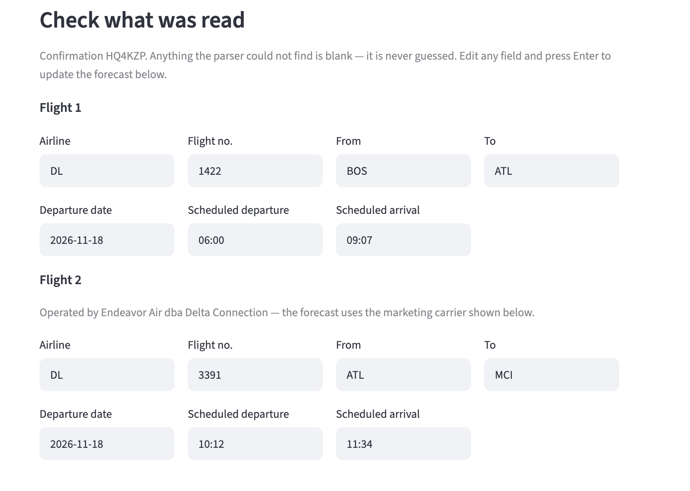

# Murphy

**Will I land on time?**

Murphy turns a pasted booking confirmation into an arrival-delay *range* built
from real historical flights — and shows you exactly which flights it used. When
the evidence is too thin, it refuses to forecast rather than guessing.

Course project for CS 5542 (Big Data Analytics & Applications), Fall 2026.
This repository is the Challenge 2 Human–AI Co-Design slice: the first working
vertical slice of the end-user application.



---

## What the application does

A traveller pastes a booking confirmation. Then:

1. **An LLM parses it** into validated JSON — flight numbers, airports, dates,
   scheduled times. Anything it cannot find comes back null.
2. **The traveller reviews and corrects** the parsed fields. Nothing is guessed
   on their behalf, so blank fields are questions, not failures.
3. **SQL retrieval** finds comparable historical flights: same route, airline,
   month and departure-hour band, over 6.28 million 2024 flight records.
4. **Code computes an arrival-delay range** — the empirical 10th, 50th and 90th
   percentiles of what those flights actually did.
5. **The evidence is shown** — the individual flights with their record IDs,
   observed delays and the weather on the day, plus the SQL that produced the
   numbers.
6. **The traveller corrects anything wrong and re-runs.**

### The rule that shapes everything

**The language model never produces a number.** It reads text and returns
structured fields; that is its entire job. Every figure on screen is computed by
SQL over rows the traveller can open and inspect.

### When it will not answer

Asking for a route with no service returns a refusal, not a range:



The fallback ladder widens the match in stated steps — a wider departure window,
then any month, then any carrier — and reports which step answered. If nothing
reaches ten comparable flights, it declines.

Confidence tracks **match quality**, not just sample size. A query answered from
196 loosely matched flights is reported as *less* trustworthy than one answered
from 29 exact ones, because reaching that larger number meant giving up the
traveller's own airline and month.

---

## Running it

Requires Python 3.10+ and the 2024 data file (see **Data** below).

```bash
python3 -m venv .venv
.venv/bin/python -m pip install -r requirements.txt

# One free API key, from https://console.groq.com -> API Keys
cp .env.example .env        # then paste your key into GROQ_API_KEY

# Build the queryable table from the raw CSV (about a minute)
.venv/bin/python src/murphy/build_parquet.py

# Run the app
.venv/bin/streamlit run app/app.py
```

The app opens at `http://localhost:8501`. Click **Start from a sample
confirmation** to try it without digging out your own booking.

Useful on their own:

```bash
# Verify the raw data against the assumptions in the plan
.venv/bin/python notebooks/01_schema_check.py

# Query the retrieval layer directly
.venv/bin/python src/murphy/retrieval.py --origin BOS --dest ATL \
    --carrier DL --month 11 --hour 6 --json

# Parse a confirmation from the command line
.venv/bin/python src/murphy/parser.py tests/fixtures/confirmation_synthetic.txt
```

---

## Data

**Source:** [MFDD multi-modal flight delay dataset](https://www.kaggle.com/datasets/flnny123/mfddmulti-modal-flight-delay-dataset)
(Kaggle), 2024 file — BTS on-time performance records with weather joined.
Download `flight_with_weather_2024.csv` into `data/raw/`. It is 1.6 GB and is
not committed.

A 300-row sample is committed at `data/raw/sample_rows_2024.csv` so the schema
can be inspected without the full download. It is far too small for retrieval —
comparable-flight counts drawn from it would be meaningless.

**After processing:** 6,284,734 rows, 305 airports, 15 carriers, stored as
Parquet partitioned by origin — 81 MB, queried with DuckDB.

### Verified limitations

The schema was checked against the real file rather than assumed. Three findings
constrain what the application can honestly claim, and all three are surfaced in
the interface rather than buried here. Full detail in
[`notebooks/schema_findings.md`](notebooks/schema_findings.md).

- **The timestamp columns are unusable for arithmetic.** The source pre-converted
  BTS `HHMM` integers to timestamps but never applied midnight rollover, so
  213,203 flights (3.39%) arrive before they depart. The times are also local
  with no timezone column, so clock duration disagrees with the stored scheduled
  duration on half the file. Everything here works in delay-minutes instead;
  a clock time is constructed only to show the traveller a landing window, from
  their own scheduled arrival plus an offset.
- **March 2024 is missing entirely** — eleven months, 335 days. A March query
  finds nothing on an exact match and falls to a widened one, which the app
  discloses.
- **Cancelled and diverted flights were removed upstream.** Every row is a flight
  that operated, so the application cannot speak to cancellation risk and every
  range is conditional on the flight operating at all. The interface says so on
  every result.

---

## The AI capability

**Structured generation, grounded by retrieval.**

| Component | Role |
|---|---|
| **LLM** (Groq, `openai/gpt-oss-120b`) | Parses confirmation text into validated JSON against a Pydantic schema. Nothing else. |
| **Retrieval** | SQL + metadata filter over partitioned Parquet, with a disclosed fallback ladder. |
| **Tools** | DuckDB computes the quantiles, the counts and the weather split. |

Retrieval here is **structured, not vector**, and that is a deliberate choice.
"BOS→ATL, Delta, November, morning" is exactly specifiable, so relational
equality is the correct instrument; embeddings do not enforce it and would
happily return BOS→ORD for BOS→ATL. Vector retrieval earns its place later in
the project, where the query becomes "a day like this one" and stops being
specifiable at all.

Two rules are enforced in code rather than trusted to the prompt:

- **Missing means null.** A value the model cannot locate is never inferred. City
  names are not converted to airport codes — "Chicago" could be ORD or MDW, and
  resolving it would be a guess.
- **Parsed values are checked against the data.** A carrier or airport absent
  from the 2024 file is reported as a problem, not passed into a query.

---

## Human review

The traveller stays in the loop at two points, and both change the output:

1. **Correct the parse.** Every parsed field is editable. Blank fields are
   flagged as needed before that leg can be forecast.
2. **Inspect the evidence.** The comparable flights are listed with record IDs,
   dates, observed delays and the weather on the day. The provenance panel shows
   the dataset, the match, the fallback rung that answered, how the percentiles
   were computed, and the exact SQL.



More screenshots in [`screenshots/`](screenshots/).

---

## Testing

```bash
.venv/bin/pytest -q
```

Twelve cases, including four failure cases: a route with no evidence, a month
absent from the data, unusable airline and airport codes, and text containing no
flights at all.

The suite runs from a fresh clone without failing. Tests that query the flight
table skip with a clear reason until `build_parquet.py` has been run, and the
parser tests skip without an API key — so a missing prerequisite reads as
`10 skipped`, naming what is absent, rather than as a wall of errors.

Case-by-case reasoning — what each test feeds in, what the system does, and why
that is correct — is in [`tests/RESULTS.md`](tests/RESULTS.md).

---

## Project layout

```
app/                  Streamlit application
src/murphy/
  build_parquet.py    raw CSV -> partitioned Parquet
  parser.py           confirmation text -> validated itinerary JSON
  retrieval.py        comparable-flight retrieval and the empirical range
  config.py           .env loading
notebooks/
  01_schema_check.py  data verification, reproduces the findings below
  schema_findings.md  what the verification found
tests/                test suite, fixtures, and case-by-case results
screenshots/          the application in use
data/raw/             source CSV (not committed)
data/processed/       Parquet table (not committed, rebuild with the script)
```

---

## What remains to be developed

This slice answers *"will I land on time?"* for a single flight. The wider
project continues from here:

- **A trained forecaster.** The empirical range over retrieved comparables is the
  baseline any model has to beat. Whether gradient-boosted quantile regression
  actually beats looking up similar flights is an open question, and the next
  thing to be measured.
- **Connection risk.** Turning an arrival distribution plus connection slack into
  the probability of missing a transfer — the point at which a range becomes a
  decision.
- **A trust layer.** Calibration, conformal intervals and out-of-distribution
  detection, so the application can say how much to believe itself. The
  confidence downgrade on a loose match is the first small piece of this.
- **Vector retrieval** over network state, for "have I seen a day like this
  before?" — a question SQL cannot express.
- **Rebooking.** Scoring alternative flights and recommending one, or
  recommending staying put when the alternatives are no better.
