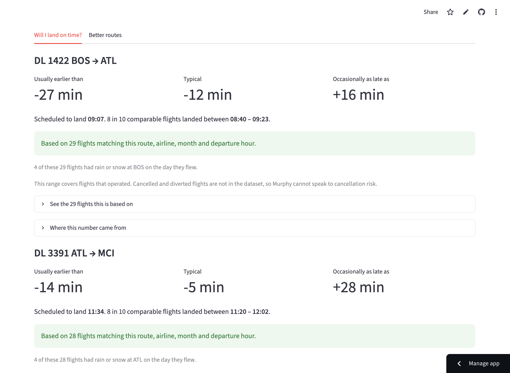
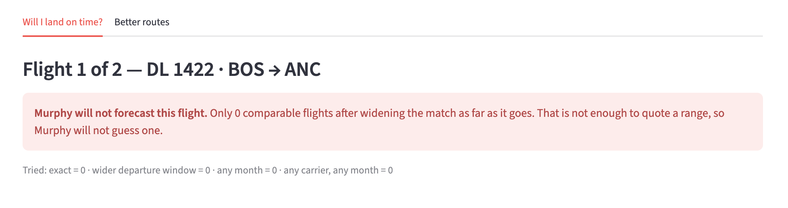
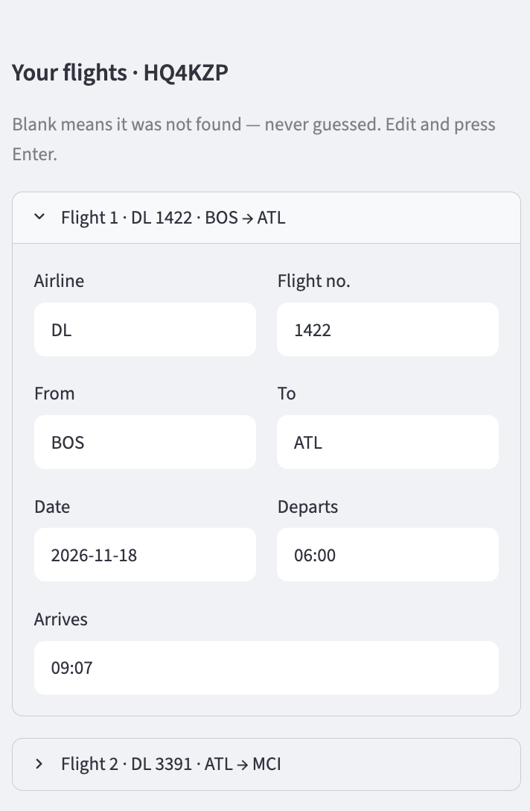

# Murphy

**Will I land on time?**

Murphy turns a booking confirmation into an arrival-delay *range* built from real
historical flights — and shows you exactly which flights it used. When the
evidence is too thin, it refuses to answer rather than guessing.

**Try it: [murphy-challenge-2.streamlit.app](https://murphy-challenge-2.streamlit.app/)**

Course project for CS 5542 (Big Data Analytics & Applications), Fall 2026.
This repository is the Challenge 2 slice: the first working piece of the
end-user application.



---

## Who it is for

**Anyone flying with something to lose** — a connection to make, a meeting to
reach, a deadline that does not move.

Explicitly **not airlines**. They hold crew, gate, baggage and load data
internally, so a public-data model is strictly worse for them. Passengers have
only public data. That asymmetry is the opportunity.

## What it does

1. **An AI reads your confirmation** into structured fields — or you type them in
   yourself. Anything it cannot find is left **null and asked for**, never guessed.
2. **You correct anything wrong.** Every field is editable and the results update.
3. **Retrieval finds comparable flights** — same route, carrier, month and
   departure hour — across 6.9 million 2024 records.
4. **Two independent forecasts.** The empirical range over those flights, and a
   trained quantile model. Both are shown.
5. **Alternative routes**, ranked by reliability or speed, with your own route
   placed among them.

### The rule that shapes everything

**The language model never produces a number.** It reads text and returns
structured fields; that is its whole job. Every figure on screen is computed by
SQL over rows you can open and read.

### When it will not answer



The fallback ladder widens the match in stated steps — a wider departure window,
then any month, then any carrier — and reports which step answered. Below ten
comparable flights it declines.

Confidence also tracks **match quality**, not just sample size. An answer built
from 196 loosely matched flights is reported as *less* trustworthy than one from
29 exact matches, because reaching that number meant giving up your airline and
your month.

---

## Does a trained model beat looking things up?

The question this challenge was built to answer. **Yes, by about 11%** — but the
lookup remains a respectable baseline, which is itself the finding.

| | pinball loss | 80% coverage | median error | interval width |
|---|---|---|---|---|
| Retrieval (L1) | 9.542 | 70.9% | 13.0 min | 59.0 min |
| **Trained model (L2)** | **8.476** | **77.0%** | **10.9 min** | 59.2 min |

Trained on 2023, scored on all 6,860,395 flights that operated in 2024.

**The width column matters most.** The model is not winning by hedging — its
intervals are the same width as the lookup's while covering more of the truth.
Neither is calibrated, though: an 80% interval should contain the outcome 80% of
the time, and both fall short. Fixing that properly is conformal prediction, and
it is future work rather than something claimed here.

Full detail and caveats: [`tests/MODEL_COMPARISON.md`](tests/MODEL_COMPARISON.md).

## Does risk-aware routing beat sorting by scheduled time?

**It halves the missed-connection rate and costs about ten minutes.**

| | scheduled-time | Murphy |
|---|---|---|
| Missed connections | 75 (8.1%) | **39 (4.2%)** |
| Median door-to-door | 315 min | 325 min |
| Mean, failures charged 240 min | 341 min | **340 min** |

Over 930 planning decisions on ten routes, ranking on 2023 and scoring on October
2024. Once failures are charged the two are a dead heat, which makes the answer
depend on how much a traveller hates missing a connection — a preference, not a
fact, and the reason the application exposes the objectives rather than choosing
for them.

Full method: [`tests/EVALUATION.md`](tests/EVALUATION.md).

---

## Running it

Requires Python 3.10+.

```bash
python3 -m venv .venv
.venv/bin/python -m pip install -r requirements.txt

# One free API key from https://console.groq.com -> API Keys
cp .env.example .env        # paste your key into GROQ_API_KEY

# The flight table and the trained model are in the repository already
.venv/bin/streamlit run app/app.py
```

Opens at `http://localhost:8501`. Pick a sample in the sidebar, or enter a flight
by hand.

### Command line

```bash
# Verify the raw data against its assumptions
.venv/bin/python notebooks/01_schema_check.py

# Query the retrieval layer
.venv/bin/python src/murphy/retrieval.py --origin BOS --dest ATL \
    --carrier DL --month 11 --hour 6 --json

# Plan routes, with the traveller's own route ranked
.venv/bin/python src/murphy/graph.py --origin BOS --dest MCI \
    --month 11 --hour 6 --booked-carrier DL --via ATL

# Parse a confirmation
.venv/bin/python src/murphy/parser.py tests/fixtures/confirmation_synthetic.txt

# Retrain the model and re-run the L1/L2 comparison (needs the full table)
.venv/bin/python src/murphy/model.py

# Compare risk-aware routing against scheduled-time routing
.venv/bin/python src/murphy/evaluate.py
```

### Deploying

Runs on Streamlit Community Cloud unmodified. Point an app at this repository
with `app/app.py` as the entry point, and under **Advanced settings → Secrets**
add:

```toml
GROQ_API_KEY = "your-key-here"
```

`src/murphy/config.py` reads the process environment, then Streamlit secrets,
then `.env`, so the same code runs locally and deployed.

---

## Data

**Flights** — [US Bureau of Transportation Statistics, On-Time Performance](https://www.bts.gov/browse-statistical-products-and-data/bts-publications/airline-service-quality-performance-234-time).
**Weather** — [NOAA Integrated Surface Database](https://www.ncei.noaa.gov/products/land-based-station/integrated-surface-database),
hourly station observations joined by airport and hour.

**Committed:** 2024, 6,971,908 flights, 305 airports, 15 carriers, 172 MB of
Parquet. A clone runs without downloading anything.

**To rebuild, or to get 2023 as well** (needed to retrain the model):

```bash
.venv/bin/python src/murphy/fetch_bts.py --years 2023 2024
.venv/bin/python src/murphy/fetch_isd.py --years 2023 2024
.venv/bin/python src/murphy/build_parquet_bts.py
```

The weather fetch streams: each station-year is downloaded, reduced to the
fields needed, and deleted. Peak disk use is one 10 MB file.

### Why this data, and not the preprocessed alternative

The project began on a Kaggle-preprocessed version of the same BTS records and
moved off it after verification found four problems. Recorded here because they
shaped the design:

- **Cancelled and diverted flights had been stripped**, so the application was
  blind to the outcome travellers care most about — and weather, which causes
  more cancellations than anything else, is exactly when it mattered.
- **Timestamps were converted without midnight rollover**, so 213,203 flights
  (3.39%) arrived before they departed, and scheduled duration agreed with the
  clock on only half the file.
- **March was missing entirely.**
- **No tail numbers, no delay causes, no marketing carrier.**

Rebuilding from the primary source fixed all four. Flights arriving before
departing went from 213,203 to **zero**, and duration now agrees with the clock
on **100%** of rows. The delay distribution came out unchanged — p10/p50/p90 of
−23/−6/+42 against −23/−6/+43 — which is what says the rebuild is correct rather
than merely different.

### Known limitations

- **Alternative routes may no longer be flown.** They are built from flights that
  operated in the same month of 2024. Performance carries over well; the
  continued existence of a service does not. Treat them as routings that tend to
  work, not as flights you can book.
- **Connections are constructed, not published** — a real arrival paired with a
  real departure under a 45-minute minimum transfer, not a fare an airline sells.
- **The model assumes typical weather.** No forecast exists for a flight months
  away, so it predicts under median conditions for that airport and month. On a
  bad day it will read optimistic.
- **No fare data**, so cost never enters any ranking.
- **Guam and Pago Pago** have no weather station within 15 km and carry null
  weather.

---

## The AI capability

| Component | Role |
|---|---|
| **LLM** (Groq, `openai/gpt-oss-120b`) | Parses confirmation text into a validated Pydantic schema. Nothing else. |
| **Retrieval** | SQL and metadata filter over partitioned Parquet, with a disclosed fallback ladder. |
| **Model** | XGBoost quantile regression, twelve features, trained against pinball loss. |
| **Tools** | DuckDB computes every quantile, count, connection risk and weather split. |

Retrieval here is **structured, not vector**, and that is deliberate.
"BOS→ATL, Delta, November, morning" is exactly specifiable, so relational
equality is the correct instrument; embeddings do not enforce it and would
return BOS→ORD for BOS→ATL. Vector retrieval earns its place when the query
becomes "a day like this one" and stops being specifiable.

Two rules are enforced in code rather than trusted to the prompt:

- **Missing means null.** City names are not converted to airport codes —
  "Chicago" could be ORD or MDW, and resolving it would be a guess.
- **Parsed values are checked against the data.** A carrier or airport absent
  from the file is reported, not passed into a query.

---

## Human review

The traveller stays in the loop at four points:

1. **Correct the parse** — every field is editable, blanks are flagged.
2. **Enter an itinerary by hand** — no confirmation needed.
3. **Inspect the evidence** — the comparable flights with record IDs, observed
   delays and the weather on the day, plus the exact SQL.
4. **Compare alternatives** and re-rank them by reliability, speed or stops.



More in [`screenshots/v2/`](screenshots/v2/).

---

## Testing

```bash
.venv/bin/pytest -q
```

Eighteen cases, five of them failures: a route with no evidence, unusable airline
and airport codes, a confirmation missing its airports, and text containing no
flights at all.

The suite runs from a fresh clone without failing. Tests that query the flight
table skip with a stated reason until it is built, and the parser tests skip
without an API key — so a missing prerequisite reads as `skipped`, naming what is
absent, rather than as a wall of errors.

Case-by-case reasoning: [`tests/RESULTS.md`](tests/RESULTS.md).

---

## Layout

```
app/app.py              the Streamlit application
src/murphy/
  fetch_bts.py          download BTS On-Time Performance
  fetch_isd.py          download and reduce NOAA observations
  build_parquet_bts.py  join them into the queryable table
  parser.py             confirmation text -> validated itinerary
  retrieval.py          comparable-flight retrieval and the empirical range
  graph.py              top-k route planning over the flight network
  model.py              train the quantile model, compare against retrieval
  forecast.py           serve the model for one flight
  evaluate.py           risk-aware routing against scheduled-time routing
  config.py             configuration lookup
notebooks/              data verification and what it found
tests/                  suite, fixtures, results, evaluations
screenshots/v2/         the application in use
data/processed/         the flight table and trained model (committed)
```

---

## What remains

- **Calibration.** Neither forecast is calibrated. Conformal prediction is the
  method, and it needs a dedicated calibration split.
- **Cancellation as a prediction**, not just a reported rate. The data now
  supports it.
- **A time-expanded graph.** Connection feasibility depends on when the previous
  leg actually arrived, and standard k-shortest-path tools cannot express a
  constraint like that over a plain airport graph — the nodes have to carry time.
- **Correlated risk.** Legs are scored independently, so a late inbound to a hub
  is treated as unrelated to everything else late at that hub.
- **Monitoring.** The system answers when asked. The useful version watches.
