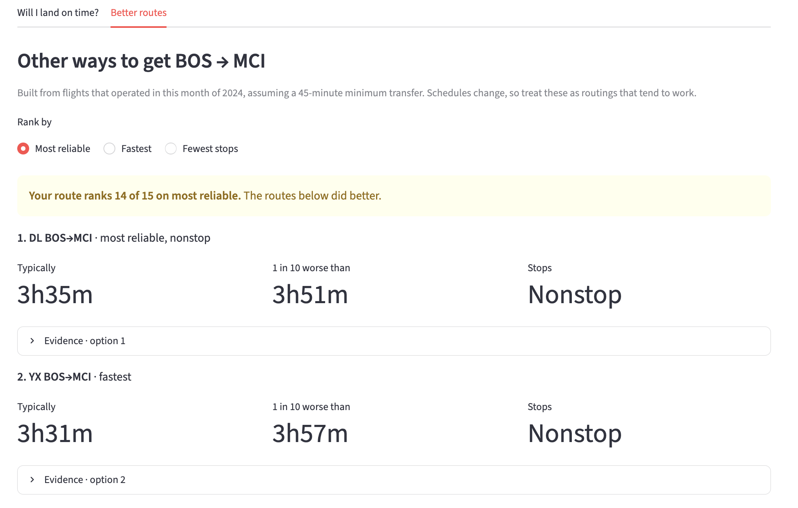
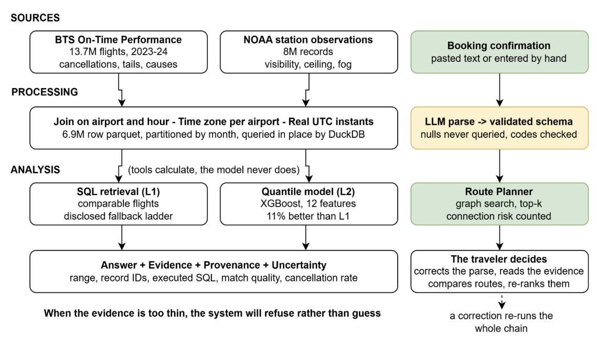

# Murphy

**Will I land on time?**

Murphy turns a booking confirmation into an arrival-delay *range* built from real
historical flights, and shows you exactly which flights it used. When the
evidence is too thin, it refuses to answer rather than guessing.

**Try it: [murphy-challenge-2.streamlit.app](https://murphy-challenge-2.streamlit.app/)**


---

## The project

Murphy forecasts flight disruption risk and states how much to trust its own
forecast. It is built for **anyone flying with something to lose**: a connection
to make, a meeting to reach, a deadline that does not move. It is deliberately
not built for airlines, who hold crew, gate, baggage and load data internally;
passengers have only public data, and that asymmetry is the opportunity.

The research claim behind the whole project is that *a forecasting system which
knows when to distrust itself produces better decisions than one that is merely
accurate.*

The full semester project covers forecasting, connection risk, a trust layer,
rebooking and monitoring. **This repository is the Challenge 2 slice only:** the
first working piece of the end-user application, answering one question.

Course project for CS 5542 (Big Data Analytics and Applications), Fall 2026.

---

## Contents

- [Layout](#layout)
- [The Challenge 2 feature](#the-challenge-2-feature)
- [Running it](#running-it)
- [Data](#data)
- [Pipeline and architecture](#pipeline-and-architecture)
- [The AI capability](#the-ai-capability)
- [Results](#results)
- [Testing](#testing)
- [Limitations and what remains](#limitations-and-what-remains)

---

## Layout

```
app/app.py              the Streamlit application
src/murphy/
  fetch_bts.py          download BTS On-Time Performance
  fetch_isd.py          download and reduce NOAA observations
  build_parquet_bts.py  join them into the queryable table
  parser.py             confirmation text -> validated itinerary
  retrieval.py          comparable-flight retrieval and the empirical range
  graph.py              top-k route planning over the flight network
  model.py              train the quantile model, compare against retrieval
  forecast.py           serve the model for one flight
  evaluate.py           risk-aware routing against scheduled-time routing
  config.py             configuration lookup
notebooks/              data verification and what it found
tests/                  suite, fixtures, results, evaluations
screenshots/v2/         the application in use
data/processed/         the flight table and trained model (committed)
```

---

## The Challenge 2 feature

The traveler asks one question, **"Will I land on time?"**, and gets an answer
they can check and correct.

1. **An AI reads your confirmation** into structured fields, or you type them in
   yourself. Anything it cannot find is left **null and asked for**, never
   guessed. ([`01_landing`](screenshots/v2/01_landing.png),
   [`11_missing_field`](screenshots/v2/11_missing_field.png))
2. **You correct anything wrong.** Every field is editable and the results
   update. ([`02_sidebar`](screenshots/v2/02_sidebar.png),
   [`06_two_legs`](screenshots/v2/06_two_legs.png))
3. **Retrieval finds comparable flights** on the same route, carrier, month and
   departure hour, across 6.9 million 2024 records. You can open every row it
   used, with the weather on the day and the exact SQL.
   ([`04_evidence`](screenshots/v2/04_evidence.png),
   [`05_provenance`](screenshots/v2/05_provenance.png))
4. **Two independent forecasts**: the empirical range over those flights, and a
   trained quantile model. Both are shown.
   ([`03_forecast`](screenshots/v2/03_forecast.png))
5. **Alternative routes**, ranked by reliability, speed or stops, with your own
   route placed among them.
   ([`07_routes`](screenshots/v2/07_routes.png),
   [`08_route_evidence`](screenshots/v2/08_route_evidence.png))



Two rules shape everything the feature does.

**The language model never produces a number.** It reads text and returns
structured fields; that is its whole job. Every figure on screen is computed by
SQL over rows you can open and read.

**It refuses when the evidence is too thin.** The fallback ladder widens the
match in stated steps, a wider departure window, then any month, then any
carrier, and reports which step answered. Below ten comparable flights it
declines. Confidence also tracks *match quality*, not just sample size: an answer
built from 196 loosely matched flights is reported as **less** trustworthy than
one from 29 exact matches, because reaching that number meant giving up your
airline and your month.


All twelve screenshots, including the failure cases, are in
[`screenshots/v2/`](screenshots/v2/).

---

## Running it

Requires Python 3.10 or newer.

```bash
python3 -m venv .venv
.venv/bin/python -m pip install -r requirements.txt

# One free API key from https://console.groq.com -> API Keys
cp .env.example .env        # paste your key into GROQ_API_KEY

# The flight table and the trained model are in the repository already
.venv/bin/streamlit run app/app.py
```

Opens at `http://localhost:8501`. Pick a sample in the sidebar, or enter a flight
by hand.

### Command line

```bash
# Verify the raw data against its assumptions
.venv/bin/python notebooks/01_schema_check.py

# Query the retrieval layer
.venv/bin/python src/murphy/retrieval.py --origin BOS --dest ATL \
    --carrier DL --month 11 --hour 6 --json

# Plan routes, with the traveler's own route ranked
.venv/bin/python src/murphy/graph.py --origin BOS --dest MCI \
    --month 11 --hour 6 --booked-carrier DL --via ATL

# Parse a confirmation
.venv/bin/python src/murphy/parser.py tests/fixtures/confirmation_synthetic.txt

# Retrain the model and re-run the L1/L2 comparison (needs the full table)
.venv/bin/python src/murphy/model.py

# Compare risk-aware routing against scheduled-time routing
.venv/bin/python src/murphy/evaluate.py
```

### Deployed

A running instance is at
[murphy-challenge-2.streamlit.app](https://murphy-challenge-2.streamlit.app/),
which needs nothing installed and no key of your own.

It deploys from this repository unmodified, because `src/murphy/config.py` looks
for configuration in the process environment, then Streamlit secrets, then
`.env`, so the same code runs locally and hosted.

---

## Data

**Flights**: [US Bureau of Transportation Statistics, On-Time Performance](https://www.transtats.bts.gov/DL_SelectFields.aspx?gnoyr_VQ=FGJ&QO_fu146_anzr=b0-gvzr).
13.7M flights across 2023 and 2024, 305 airports, 15 carriers, 6,337 tail numbers.

**Weather**: [NOAA Integrated Surface Database](https://www.ncei.noaa.gov/products/land-based-station/integrated-surface-database).
8.0M hourly station observations, joined by airport and hour.

**Committed:** 2024, 6,971,908 flights, 172 MB of Parquet. A clone runs without
downloading anything.

**To rebuild, or to get 2023 as well** (needed to retrain the model):

```bash
.venv/bin/python src/murphy/fetch_bts.py --years 2023 2024
.venv/bin/python src/murphy/fetch_isd.py --years 2023 2024
.venv/bin/python src/murphy/build_parquet_bts.py
```

The weather fetch streams: each station-year is downloaded, reduced to the fields
needed, and deleted before the next one starts. Peak disk use is one 10 MB file.

The project began on a Kaggle-preprocessed version of the same BTS records and
moved off it after verification found four defects, including 213,203 flights
that arrived before they departed and a missing month. Rebuilding from the
primary source fixed all four while leaving the delay distribution unchanged,
which is what says the rebuild is correct rather than merely different. The full
account is in the Challenge 2 report.

---

## Pipeline and architecture



Two sources are joined into one queryable table, which three components read
independently: SQL retrieval, the trained model, and the route planner. The
language model sits outside that path entirely, turning text into a validated
itinerary and nothing else. Every number reaching the traveler is computed by a
tool over rows they can open.

| Stage | What happens |
|---|---|
| **Ingest** | 24 monthly BTS files and 304 NOAA station-years, both streamed and reduced on the way in |
| **Clean** | Drop negative-duration and duplicate records; keep cancelled and diverted flights rather than discarding them |
| **Transform** | Local HHMM integers plus a per-airport timezone become real UTC instants; ISD's packed fields become typed columns |
| **Join** | Weather attached at each end on the hour of departure and arrival, taking the *worst* condition in that hour rather than the mean |
| **Store** | Parquet partitioned by month, sorted by origin and carrier so repeated strings compress; 6.9M rows in 172 MB |
| **Serve** | DuckDB queries the files directly; no database server, no cluster, no load step |

---

## The AI capability

| Component | Role |
|---|---|
| **LLM** (Groq, `openai/gpt-oss-120b`) | Parses confirmation text into a validated Pydantic schema. Nothing else. |
| **Retrieval** | SQL and metadata filter over partitioned Parquet, with a disclosed fallback ladder. |
| **Model** | XGBoost quantile regression, twelve features, trained against pinball loss. |
| **Tools** | DuckDB computes every quantile, count, connection risk and weather split. |

Retrieval here is **structured, not vector**, and that is deliberate. "BOS to ATL,
Delta, November, morning" is exactly specifiable, so relational equality is the
correct instrument; embeddings do not enforce it and would return BOS to ORD for
BOS to ATL. Vector retrieval earns its place when the query becomes "a day like
this one" and stops being specifiable.

Two rules are enforced in code rather than trusted to the prompt:

- **Missing means null.** City names are not converted to airport codes, because
  "Chicago" could be ORD or MDW and resolving it would be a guess.
- **Parsed values are checked against the data.** A carrier or airport absent
  from the file is reported, not passed into a query.

---

## Results

**Does a trained model beat looking things up? Yes, by about 11%.**

| | pinball loss | 80% coverage | median error | interval width |
|---|---|---|---|---|
| Retrieval (L1) | 9.542 | 70.9% | 13.0 min | 59.0 min |
| **Trained model (L2)** | **8.476** | **77.0%** | **10.9 min** | 59.2 min |

Trained on 2023, scored on the 6,860,395 flights that operated in 2024. The width
column is the one that matters: the model covers more outcomes without widening
its interval to do it. Neither method is calibrated, and fixing that is future
work. Full detail: [`tests/MODEL_COMPARISON.md`](tests/MODEL_COMPARISON.md).

**Does risk-aware routing beat sorting by scheduled time? It halves the
missed-connection rate and costs about ten minutes.**

| | scheduled-time | Murphy |
|---|---|---|
| Missed connections | 75 (8.1%) | **39 (4.2%)** |
| Median door-to-door | 315 min | 325 min |
| Mean, a missed connection charged 4 h | 341 min | **340 min** |

Over 930 planning decisions on ten routes, ranking on 2023 and scoring on October
2024. Once failures are charged the two are a dead heat, so the answer depends on
how much a traveler hates missing a connection, which is a preference the data
cannot settle. That is why the application exposes the objectives instead of
choosing for them. Full method: [`tests/EVALUATION.md`](tests/EVALUATION.md).

---

## Testing

```bash
.venv/bin/pytest -q
```

Eighteen cases, five of them failure cases: a route with no evidence, unusable
airline and airport codes, a confirmation missing its airports, and text
containing no flights at all.

The suite runs from a fresh clone without failing. Tests that query the flight
table skip with a stated reason until it is built, and the parser tests skip
without an API key, so a missing prerequisite reads as `skipped` naming what is
absent rather than as a wall of errors.

Case-by-case reasoning: [`tests/RESULTS.md`](tests/RESULTS.md).

---

## Limitations and what remains

**What it cannot do today**

- **Neither forecast is calibrated.** An 80% interval should contain the outcome
  80% of the time; both fall short, the retrieval baseline more than the model.
- **Alternative routes may no longer be flown.** They are built from flights that
  operated in the same month of 2024. Performance carries over well; the
  continued existence of a service does not. Treat them as routings that tend to
  work, not as flights you can book.
- **Connections are constructed, not published**: a real arrival paired with a
  real departure under a 45-minute minimum transfer, not a fare an airline sells.
- **The model assumes typical weather.** No forecast exists for a flight months
  away, so it predicts under median conditions for that airport and month. On a
  bad day it will read optimistic.
- **No fare data**, so cost never enters any ranking.
- **Legs are scored independently**, so a late inbound to a hub is treated as
  unrelated to everything else late at that hub.
- **Guam and Pago Pago** have no weather station within 15 km and carry null
  weather.

**Next**

- **Calibration** through conformal prediction, which needs a dedicated
  calibration split.
- **Cancellation as a prediction**, not just a reported rate. The data now
  supports it.
- **A time-expanded graph.** Connection feasibility depends on when the previous
  leg actually arrived, and standard k-shortest-path tools cannot express a
  constraint like that over a plain airport graph; the nodes have to carry time.
